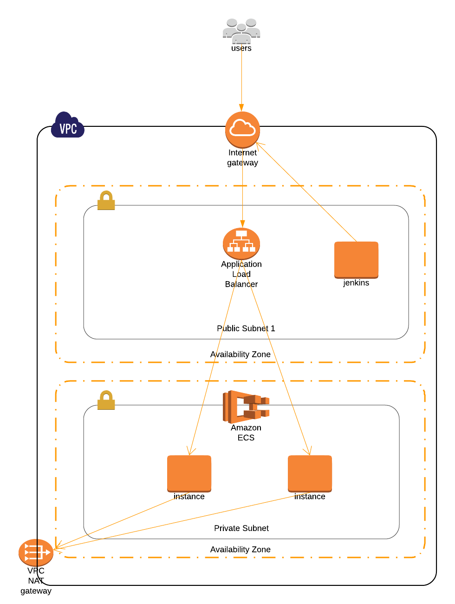

# Openrisk-Infra

## Architect

##How To Use

1. Clone the repository  
2. Move inside `scripts` folder
3. Move inside `scripts/packer` and create a packer ami for Jenkins `packer build jenkins.json`
4. Move inside `scripts/terraform/environments/development/` and run `terraform init`
5. Check for resources to be created using `terraform plan`
6. Create new resources using command `terraform apply`

That's it !!!
